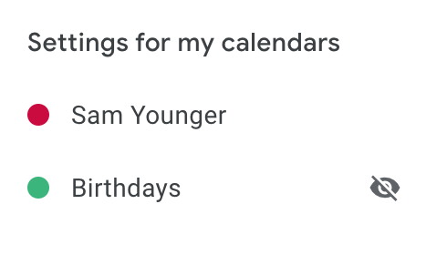
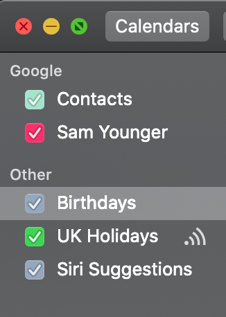
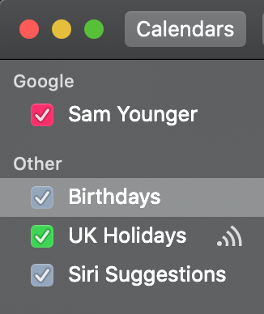

    DESCRIPTION: Google calendar contacts is showing on all iOS devices. This is a brief explanation of how to remove it.

It took me a while to find the solution to this, so I'm writing a brief post about it to save time in future - when I will inevitably forget the solution.

## Problem
The Google contacts calendar is showing up on all iOS devices. I find this infuriating when my contacts library is on iOS not Google. I am a little OCD and I like my devices to look the way I expect them to, in this case I don't want to even see a calendar in the 'calendars' list on my devices that I don't want there. I think the following solution is totally bonkers as this setting should naturally sit in https://calendar.google.com/calendar/r/settings, but Google in all their wisdom think this totally unlinked hidden page is the best UX design shrug 🤷‍♂️.

## Solution
The original solution was found [HERE](https://support.google.com/calendar/thread/10661398?hl=en). All you need to do is go [https://calendar.google.com/calendar/syncselect](https://calendar.google.com/calendar/syncselect), deselect the contacts calendar, and **save**.

## Explainer images

Google calendar settings supposedly hidden:

	

iOS calendar with google contacts showing:

	

iOS calender without google contacts showing:

	

